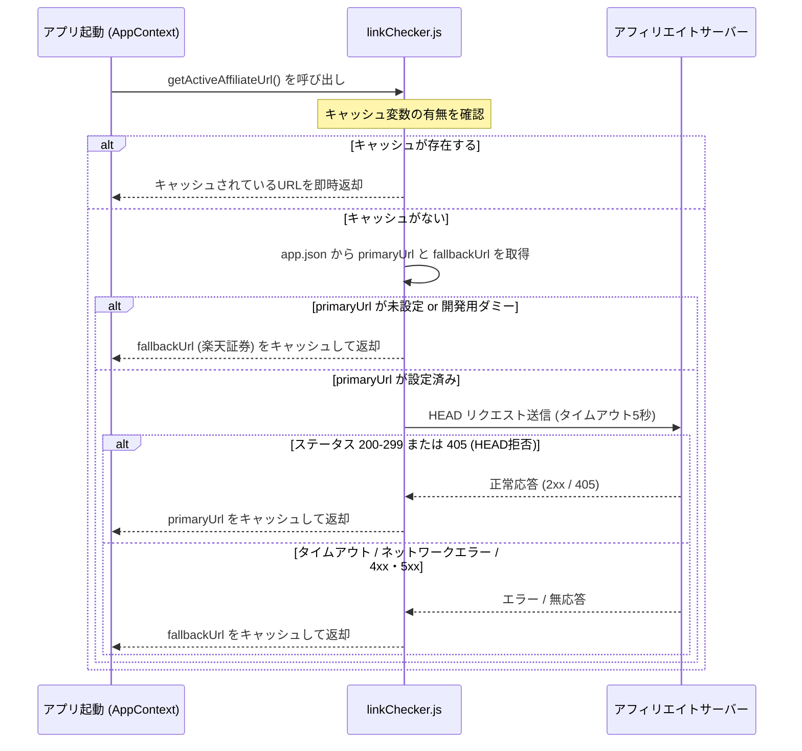

# 資産形成シミュレーター（Antigravity）システム仕様・機能ロジック詳細ドキュメント

本ドキュメントは、プロジェクト「資産形成シミュレーター（Antigravity）」の現在のシステム仕様、画面構成、データ構造、および詳細な計算・課税機能ロジックを報告するための設計・仕様説明ドキュメントです。

---

## 1. プロジェクト概要

### 1.1. アプリ概要
「資産形成シミュレーター」は、日々の生活の節約額や保有資産を投資に回した場合の「将来の推定資産」をビジュアルで予測・シミュレーションし、ユーザーの資産形成モチベーションを高めるためのモバイルアプリケーションです。

*   **ターゲットプラットフォーム**: iOS / Android (React Native, Expo)
*   **デザインアプローチ**: モードに応じたビジュアルフィードバック、直感的なスライドカード、インタラクティブなチャート表示

### 1.2. 主要設計ポリシー
1.  **完全ローカル完結型データストア**: ユーザーの資産情報や履歴データはローカルの `AsyncStorage` のみに保存され、外部データベース（Firebase等）との通信を行いません。これにより、サーバー保守運用コストおよび情報漏洩リスクを物理的にゼロにしています。
2.  **ハイブリッド課金モデル**:
    *   **広告収入（無料版）**: AdMob バナー広告およびインターステシャル動画広告を配信。
    *   **サブスクリプション / ライフタイム（有料版）**: RevenueCat を介したアプリ内課金。
3.  **シームレスな体験**: 計算と同時に自動保存を行い、手動での保存ボタン押下の手間を排除しています。

---

## 2. システムアーキテクチャ & 技術スタック

### 2.1. 技術構成

```mermaid
graph TD
    App[App.js (Entry Point)] --> NavigationContainer
    NavigationContainer --> TabNavigator[Tab.Navigator]
    
    subgraph Screens
        TabNavigator --> MainScreen[MainScreen (シミュレート)]
        TabNavigator --> HistoryScreen[HistoryScreen (履歴)]
        TabNavigator --> SettingsScreen[SettingsScreen (設定)]
      end
    
    subgraph Core Logic & State
        App --> AppProvider[AppContext / AppProvider]
        AppProvider --> Storage[storage.js (AsyncStorage)]
        AppProvider --> LinkChecker[linkChecker.js (HEAD API)]
        MainScreen --> useCalculator[useCalculator.js (Hook)]
        useCalculator --> CalcEngine[calculator.js (Engine)]
    end

    subgraph Native Integration
        AppProvider --> RevenueCat[react-native-purchases]
        MainScreen --> AdVideo[AdVideo.js / InterstitialAd]
        HistoryScreen --> AdBanner[AdBanner.js / BannerAd]
    end
```

*   **フレームワーク**: React Native (Expo SDK)
*   **ナビゲーション**: `@react-navigation/native`, `@react-navigation/bottom-tabs`
*   **UI・グラフ描画**:
    *   `react-native-gifted-charts`: 高性能・インタラクティブな棒グラフ描画
    *   `react-native-svg`: グラフ上への目標ベンチマーク点線の描画
    *   `react-native-paper`: 設定画面などでのボタンUI
    *   `react-native-safe-area-context`: ノッチあり端末（iPhone/Android）に追従するレイアウト制御
*   **永続化**: `@react-native-async-storage/async-storage`
*   **広告**: `react-native-google-mobile-ads`
*   **アプリ内課金**: `react-native-purchases` (RevenueCat)

### 2.2. 開発環境（Expo Go）と本番ビルドの切り替え
ネイティブコード（AdMob, RevenueCat）を Expo Go 環境で安全に検証するため、`__DEV__` フラグに応じた動的インポート（Dynamic Require）およびモックモジュールの差し替えロジックを実装しています。

*   **AdMob (`AdBanner.js`, `AdVideo.js`)**:
    *   `__DEV__ = true`: 動的ロードをスキップし、Dashed Border を持つUIモックや、`Alert.alert` による動画表示のシミュレーションを出力します。
    *   `__DEV__ = false`: `react-native-google-mobile-ads` を `require` し、実際のユニットIDまたはテストIDで広告を表示します。
*   **RevenueCat (`AppContext.js`)**:
    *   `__DEV__ = true`: `mockPurchases` を使用し、購入アクションで `isPremium` フラグがトグルするテスト用の疑似決済環境を提供します。
    *   `__DEV__ = false`: `react-native-purchases` を `require` して、Apple / Google Play Store 決済と疎通します。

---

## 3. 画面構成 & 機能詳細

### 3.1. シミュレート画面（`MainScreen.js`）
ユーザーが数値を入力して将来予測を行うメイン画面。画面全体のタップでキーボードが閉じる `TouchableWithoutFeedback` 設計。

*   **入力フォーム**:
    *   **積立額（円）**: `principal`。1回あたりに積み立てる金額。
    *   **運用年数（年）**: `years`。1〜50年の整数値。
    *   **現在の資産額（万円）**: `currentAsset`。シミュレーションの初期値。
    *   **想定年利（％）**: `annualRate`。0〜50%の数値。
    *   **積立頻度**: `frequencyId` （毎月 / 毎週 / 毎日 / 毎年）。
    *   **NISA投資先プリセット**: 選択すると対応する想定年利が自動入力されます。
        *   `米国株 (S&P500)`: 13.0%
        *   `全世界株 (オール・カントリー)`: 11.5%
*   **計算と自動保存**:
    *   バリデーションを通過した場合、複利計算を実行。
    *   計算結果を `SavingsCard.js` に渡し、同時に `addToHistory` により自動で履歴に保存。
    *   無料ユーザーに対しては、**3回に1回**の頻度で動画広告（インターステシャル）を表示した後に、計算結果のレンダリングおよび保存処理を行います。
*   **目標から逆算する（`TargetCalculator.js`）**:
    *   「老後資金（4,000万円）」「教育費公立（500万円）」「教育費私立（3,000万円）」「自由入力目標」のいずれかを選択し、現在の年齢と目標達成年齢、想定年利を入力することで、目標達成に必要な「月々の積立額」を逆算表示します。

### 3.2. 計算履歴画面（`HistoryScreen.js`）
過去のシミュレーション履歴を一覧表示する画面。

*   **履歴上限（プラン制限）**:
    *   無料プラン: 最大3件。上限超過時は自動的に最古の履歴が削除されます（最新3件を常時キープするトリム仕様）。
    *   プレミアムプラン: 無制限に保存。
*   **お気に入り機能（プレミアム専用）**:
    *   各履歴カード上のハートマークをタップしてお気に入り（`isFavorite: true`）に設定可能。
    *   「すべて」と「お気に入り」を切り替えるフィルタリングバーを表示。
*   **一括削除機能**:
    *   `🗑 全削除`: 履歴データをすべてクリア（全ユーザー利用可能。要確認アラート）。
    *   `🗑 ❤️以外削除`: お気に入り以外の履歴を一括でクリーンアップ（プレミアムプラン限定）。
*   **アコーディオン展開**:
    *   履歴カードをタップすることで、税金・NISA比較可能な詳細グラフ（`AssetGrowthChart`）がスライド展開されます。

### 3.3. 設定画面（`SettingsScreen.js`）
プラン確認、プレミアムプランの購入、購入内容の復元、およびサポート機能を提供。

*   **プラン比較**: 無料版とプレミアム版の機能差分テーブルを明示。
*   **アップグレード決済**:
    *   `月額サブスクリプション`: ¥100 / 月 (RevenueCat経由)
    *   `買い切りライフタイム`: ¥1,000 (永続)
*   **購入復元（Restore）**: Apple Store等での購入履歴を復元する機能（審査通過必須要件）。
*   **サブスクリプションの管理・解約**: Appleの公式サブスクリプション管理画面へ直接遷移させ、アプリ内からユーザー自身で解約・管理を可能にする導線（審査通過必須要件。iOS端末ではApp Storeアプリの該当ページが自動起動）。
*   **質問・レビュー（プレミアム専用）**:
    *   フィードバックフォームを画面内に表示（最大200文字）。
    *   「送信」で `mailto:ryuc3mm5012@gmail.com` を宛先、件名 `[資産形成シミュレーター] ユーザーからのフィードバック` とするメールアプリを起動。

---

## 4. データベース & 永続化仕様（`storage.js`）

データはすべてデバイスの `AsyncStorage` にキーバリュー形式で保存されます。

### 4.1. ストレージキーとデータ構造

| キー名 | データ型 | 説明 |
| :--- | :--- | :--- |
| `@savings_history` | `Array<Object>` | シミュレーション履歴の配列（最新順） |
| `@subscription_info` | `Object` | プレミアム課金ステータスのキャッシュ |
| `@current_asset` | `number` | ユーザーが設定した「現在の資産額」（次回起動時引き継ぎ用） |
| `@user_age` | `number` | ユーザーが設定した「現在の年齢」（逆算シミュレータ用、デフォルト: 30歳） |

#### `@savings_history` 内のエントリ構造の例
```json
{
  "id": "1685412345678-abcde",
  "savedAt": "2026-05-31T02:30:00.000Z",
  "isFavorite": false,
  "inputs": {
    "principal": 30000,
    "years": 20,
    "presetId": "sp500",
    "presetLabel": "米国株 (S&P500)",
    "annualRate": 13,
    "frequencyId": "monthly",
    "frequencyLabel": "毎月",
    "currentAsset": 1000000,
    "calculationType": "annualRate"
  },
  "result": {
    "futureValue": 43560000,
    "totalGain": 35360000,
    "gainRate": 431.2,
    "principalTotal": 8200000,
    "yearlyBreakdown": [
      {
        "year": 0,
        "value": 1000000,
        "gain": 0,
        "principalAccum": 1000000,
        "assetGrowth": 1000000
      },
      {
        "year": 1,
        "value": 1500000,
        "gain": 140000,
        "principalAccum": 1360000,
        "assetGrowth": 1130000
      }
      // ... 年数分ループ
    ]
  }
}
```

---

## 5. コア機能の数学・計算ロジック

### 5.1. 複利シミュレーション数式
シミュレータは、初期資産と定期積立額をそれぞれ複利運用した合計額を求めます。

#### 各種定義
*   $C$: 初期資産（現在の資産額）
*   $P$: 1回あたりの積立額（節約額）
*   $r$: 想定年利（％指定のため、実数は $r_{annual} = r / 100$）
*   $n$: 運用期間（年数）
*   $k$: 年間積立回数（積立頻度）
    *   毎月（Monthly）: $k = 12$
    *   毎週（Weekly）: $k = 52$
    *   毎日（Daily）: $k = 365$
    *   毎年（Yearly）: $k = 1$
*   $r_{period}$: 期間利回り
    *   $r_{period} = r_{annual} / k$（毎年積立の場合は $r_{period} = r_{annual}$）
*   $N$: 総積立期間数（総積立回数）
    *   $N = n \times k$

#### 1. 初期資産の将来価値（複利成長）
初期資産 $C$ は、年次の複利で成長します。
$$AssetGrowth_n = C \times (1 + r_{annual})^n$$

#### 2. 積立分の将来価値（期間複利成長）
毎期間の積立額 $P$ が期間複利で成長する公式です。

**年利 $r \neq 0$ の場合：**
$$SavingsGrowth_n = P \times \frac{(1 + r_{period})^N - 1}{r_{period}}$$

**年利 $r = 0$ の場合（単純積立）：**
$$SavingsGrowth_n = P \times N$$

#### 3. 将来価値の合計
$$FV_n = AssetGrowth_n + SavingsGrowth_n$$

#### 4. 累計投資元本
$$PrincipalTotal_n = C + (P \times N)$$

#### 5. 運用益と利益率
*   運用益 ($TotalGain$) = $FV_n - PrincipalTotal_n$
*   利益率 ($GainRate$) = $\frac{FV_n - PrincipalTotal_n}{PrincipalTotal_n} \times 100$ (%)

---

### 5.2. 税金およびNISA課税ロジック（`recalculateWithTaxMode`）
グラフ展開時または結果表示カードで選択された税金区分（`none` / `tax` / `nisa`）に応じ、年次ブレイクダウン（1年〜$n$年）を再計算します。

#### ① 税金なし (`none`)
上記 5.1. の標準的な複利公式をそのまま適用します（非課税口座と同等）。

#### ② 税金あり (`tax`)
日本の金融所得課税率（一律 20%）を適用し、**利益部分から毎年税金が源泉徴収される**ものとして計算します。

##### 年次処理ループ ($year = 1 \dots n$):
1.  **初期資産分（年利課税）**:
    *   課税前成長: $AssetGrowthBefore = CurrentAssetValue \times (1 + r_{annual})$
    *   発生運用益: $AssetGain = AssetGrowthBefore - CurrentAssetValue$
    *   税額: $AssetTax = \max(0, AssetGain \times 0.20)$
    *   課税後残高: $CurrentAssetValue_{new} = AssetGrowthBefore - AssetTax$
2.  **積立分（期間複利成長に対する年利課税）**:
    *   年初積立残高: $SavingsStart = SavingsValue$
    *   年末課税前（期間複利計算）:
        *   毎年積立の場合: $SavingsBefore = SavingsStart \times (1 + r_{annual}) + P$
        *   期間積立（毎月/毎週/毎日）の場合:
            年初残高から出発し、1年間で $k$ 回分の積立および期間複利計算を実行：
            $$SavingsBefore_{step} = SavingsBefore_{step-1} \times (1 + r_{period}) + P$$
    *   当年の積立元本投入額: $AddedPrincipal = P \times k$
    *   発生運用益: $SavingsGain = SavingsBefore - SavingsStart - AddedPrincipal$
    *   税額: $SavingsTax = \max(0, SavingsGain \times 0.20)$
    *   課税後積立残高: $SavingsValue_{new} = SavingsBefore - SavingsTax$
3.  **合算**:
    *   総評価額 = $CurrentAssetValue_{new} + SavingsValue_{new}$
    *   累計投資元本 = $C + (P \times k \times year)$

#### ③ NISA利用 (`nisa`)
日本の新NISAの仕様を模した、**「生涯非課税投資枠：最大1,200万円（元本ベース）」**を適用したロジックです。

*   **初期設定**:
    *   初期資産 $C$ のうち、NISA枠（非課税）と特定口座枠（課税）にそれぞれ振り分けます。
        *   NISA初期資産: $NisaAsset = \min(C, 12,000,000)$
        *   特定初期資産: $TaxableAsset = \max(0, C - 12,000,000)$
    *   NISA枠累計使用元本: $NisaPrincipal = NisaAsset$
    *   特定口座累計使用元本: $TaxablePrincipal = TaxableAsset$

##### 年次処理ループ ($year = 1 \dots n$):
1.  **初期資産分の成長**:
    *   NISA枠内初期資産（非課税で複利運用）：
        $$NisaAsset_{new} = NisaAsset \times (1 + r_{annual})$$
    *   特定口座内初期資産（毎年20%課税運用）：
        *   特定側発生益に対する課税を行い、複利成長させます。
2.  **積立分の成長**:
    *   積立時のNISA枠振り分け判定：
        毎年（または毎ステップ）、現在の $NisaPrincipal$ が1,200万円に達しているかチェックします。
        *   **空き枠あり ($Space = 12,000,000 - NisaPrincipal > 0$)**:
            積立投入額のうち $Space$ 分まではNISA（非課税）側に充当し、超過分は特定口座（課税）側に充当します。
            *   NISA側投入: $AddedToNisa = \min(P, Space)$
            *   特定側投入: $AddedToTaxable = P - AddedToNisa$
        *   **空き枠なし**:
            積立投入額はすべて特定口座（課税）側に充当します。
            *   $AddedToNisa = 0$, $AddedToTaxable = P$
        *   累計元本加算:
            *   $NisaPrincipal = NisaPrincipal + AddedToNisa$
            *   $TaxablePrincipal = TaxablePrincipal + AddedToTaxable$
    *   NISA側積立残高（非課税運用）：
        年初残高に金利を乗じ、非課税投入分を加算します。
    *   特定側積立残高（20%課税運用）：
        年初残高に金利を乗じ、課税投入分を加算後、その年の増価益に対し20%を課税・徴収します。
3.  **合算**:
    *   総評価額 = $NisaAsset_{new} + TaxableAsset_{new} + NisaSavingsValue + TaxableSavingsValue$
    *   累計投資元本 = $NisaPrincipal + TaxablePrincipal$

---

### 5.3. 目標からの逆算ロジック（`calculateRequiredSavingsWithPresetOrCustom`）
目標達成に必要な月々の積立額（$PMT$）を逆算します。

#### 数値の取得
*   現在の年齢: $Age$
*   目標の年齢: $TargetAge$
*   目標金額: $TargetAmount$（円換算）
*   想定年利: $r$（％。月利実数 $r_{monthly} = r / 100 / 12$）
*   積立期間月数: $M = (TargetAge - Age) \times 12$

#### 逆算公式
**年利 $r \neq 0$ の場合：**
目標金額を積み立てるための年金終価係数に基づく公式を用います。
$$PMT = \frac{TargetAmount \times r_{monthly}}{(1 + r_{monthly})^M - 1}$$

**年利 $r = 0$ の場合（単純均等割）：**
$$PMT = \frac{TargetAmount}{M}$$

※ 計算された積立額は、安全側に寄せるため、**小数点以下を切り上げて円単位に丸めます**（`Math.ceil(PMT)`）。

---

## 6. アフィリエイトURL生存確認仕様（`linkChecker.js`）

広告収益を最大化しつつ、無効なアフィリエイトリンクへの遷移を防ぐため、アプリ起動時にバックグラウンドでリンクの生存確認を実行します。



### 生存確認の詳細ロジック
1.  **軽量HEADリクエスト**:
    *   通信データ量を極小化するため、ボディを取得しない `method: 'HEAD'` を使用します。
2.  **タイムアウト（5秒）**:
    *   ユーザー体験を損なわないよう、`AbortController` を使用して5秒経過した時点で通信を強制終了し、自動的にフォールバックします。
3.  **モジュールスコープでのキャッシュ化**:
    *   一度確認した結果は `_cachedActiveUrl` に格納され、二重チェックを防ぎます。
4.  **フォールバックポリシー**:
    *   メインリンクが無効またはエラーの場合は、デフォルト設定されている安全なURL（デフォルト：楽天証券 `https://www.rakuten-sec.co.jp/`）を返却します。

---

## 7. 広告・マネタイズ機能仕様

### 7.1. AdMob 広告設計
*   **バナー広告 (`AdBanner.js`)**:
    *   画面の安全領域（`SafeAreaView`）の最下部に表示します。
    *   サイズ: `ANCHORED_ADAPTIVE_BANNER` (端末幅に追従するアダプティブバナー)。
    *   プレミアムユーザー（`isPremium: true`）には**完全に非表示**になります。
*   **インターステシャル動画広告 (`AdVideo.js`)**:
    *   無料ユーザーに対して表示されます。
    *   計算実行時にカウンターを加算し、**3回に1回**の計算完了タイミングでインターステシャル広告を表示します。
    *   アプリ側は広告が `CLOSED` (閉じられた) もしくは `ERROR` になったイベントをハンドリングし、その後に実際の計算結果の保存・レンダリング処理を実行します。これによって広告視聴が計算結果閲覧の条件となる設計にしています。

### 7.2. プレミアムプラン機能比較一覧

| 機能 | 無料プラン | プレミアムプラン |
| :--- | :--- | :--- |
| **利用価格** | ¥0 | ¥100 / 月 または ¥1,000（買い切り） |
| **お気に入り機能** | 利用不可（ハートロック表示） | **利用可能**（お気に入りフィルター利用可能） |
| **お気に入り以外の一括削除** | 利用不可 | **利用可能** |
| **広告（バナー・動画）** | 表示あり | **完全に非表示** |
| **履歴の保存上限** | 最大3件まで（自動トリム） | **無制限** |
| **質問・レビュー** | 利用不可（プレミアム限定） | **利用可能**（フィードバック用メール送信機能） |

---
